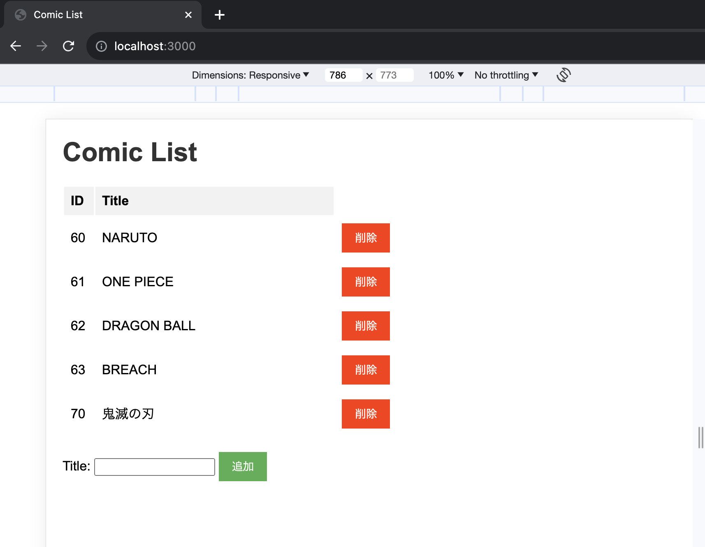

# COMIC API

## リポジトリの概要

COMIC APIは漫画(現在はタイトルのみ)の管理が簡易的に実現できます。

## エンドポイント一覧

-   GET api/comics : DBに保存されている漫画一覧を取得
-   POST api/comics : 任意の漫画をDBに保存
-   PATCH api/comics/:idOrTitle : idまたはtitleを指定して漫画保存されている漫画のタイトルを編集
-   DELETE api/comics/:idOrTitle : DBに保存されている漫画を削除

## 使い方

### git clone

```
git clone <this/repo/url>
```

### packegeインストール

```
npm install
```

### DB設定

-   psqlをインストール
-   solo_apiというデータベースを作成
-   .env.localをルートディレクトリに作成し、下記のように設定値を記載

```
DB_USER=XXX
DB_PASSWORD=XXX
DB_NAME=XXX
```

-データ設定

```
npm run migrate
npm run seed
```

### サーバ起動

-   apiコールを待つサーバをローカルに起動

```
npm run start
```

-   apiをコールするデモ用フロントエンドサイトを表示可能
    
